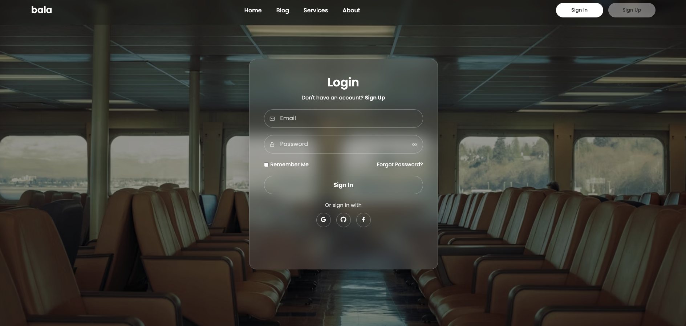

# 🔐 Login Page

[](LICENSE)  
  
  
  


---

## 🌐 Live Demo  
🔗 [View Project](https://sarangnayak.github.io/Login-Page/)

---

## 🖼️ Preview

  

---

## 🧠 About

This is a minimalist **Login Page** template/design built with **HTML**, **CSS**, and **JavaScript**.  
It emphasizes clean UI, intuitive form inputs, and responsiveness across devices.

---

## 🔧 Features

- Responsive layout (works on desktop, tablet, mobile)  
- Stylish form input effects (focus, hover)  
- Smooth transitions  
- Lightweight with minimal dependencies  
- Easy to integrate or customize  

---

## 📂 Folder Structure
```
Login-Page/
│
├── index.html         # Main login page markup
├── style.css          # Styling & transitions
├── script.js          # (Optional) validation or behavior
└── assets/             # Images, icons, preview screenshots
```
---

## 🚀 Usage / Setup

1. Clone this repository  
   ```bash
   git clone https://github.com/sarangnayak/Login-Page.git
   cd Login-Page
   ```
2.	Open index.html in your browser.
3.	(Optional) Customize styles, form behavior, or validation logic.
4.	Deploy via GitHub Pages or any static web hosting.
---

⸻

💡 Customization Ideas
	•	Add form validation (client side)
	•	Toggle show/hide password
	•	Add error & success states
	•	Include social login buttons
	•	Animate the login button (ripple, hover effect)

⸻

🤝 Contributing

Contributions are welcome!
	•	Fork the repo
	•	Create a feature branch
	•	Commit your changes
	•	Open a Pull Request

⸻

📜 License

This project is licensed under the MIT License.
See the LICENSE file for details.

⸻

👤 Author

Sarang Nayak
🔗 GitHub
🌐 Portfolio

⸻

⭐ If you like this login UI, give it a star!
---

If you want, I can also **extract the HTML / CSS / JS code** from your live demo, polish it (clean up comments, structure), and give you a ready-to-use repository template (with screenshot) based on this login page. Do you want me to do that?
---
